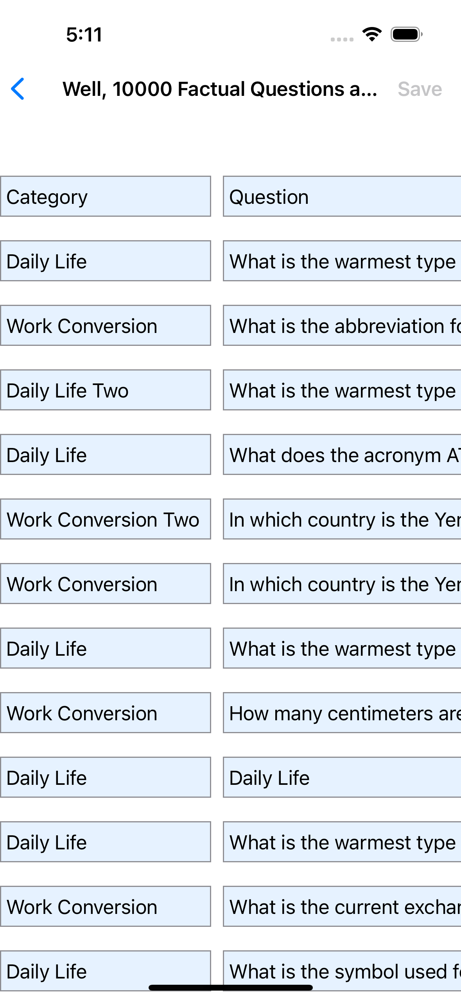
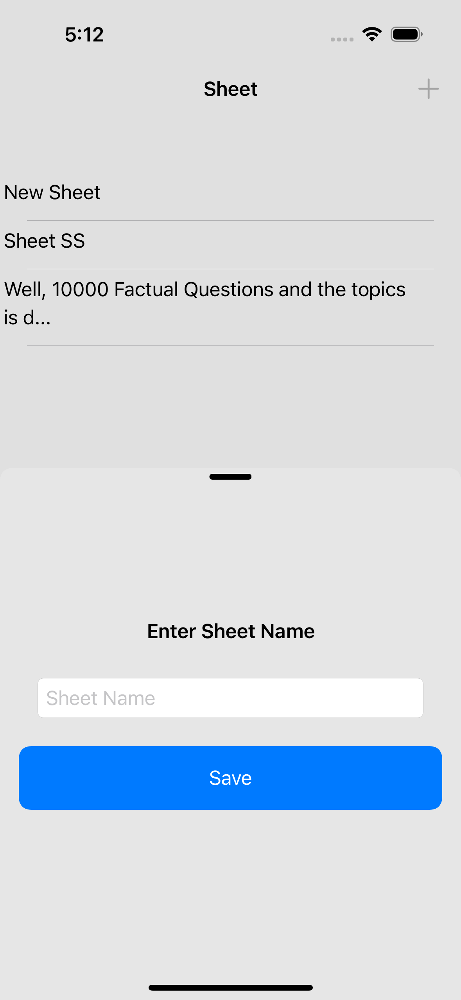
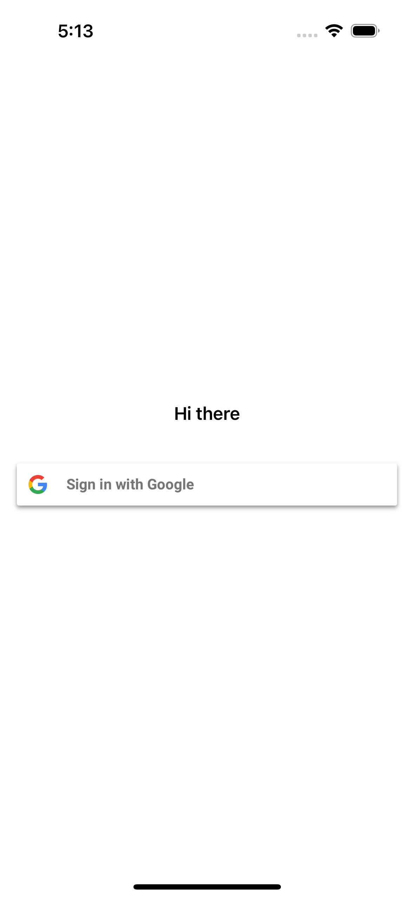

# Sheet SwiftUI App

**Sheet** is an iOS app that integrates with **Google Spreadsheets**, **Google Sign-In**, and **Realm local storage**. It allows users to authenticate with their Google accounts, retrieve and manage data from Google Spreadsheets, and store data locally using Realm for offline access.

## Features

- **Google Sign-In Integration**: Users can securely sign in with their Google accounts using the GoogleSignIn SDK.
- **Google Sheets API Integration**: Retrieve, update, and manage data from Google Sheets using GoogleAPIClientForREST_Sheets.
- **Google Drive API Integration**: Access Google Drive files related to spreadsheets using GoogleAPIClientForREST_Drive.
- **Realm Local Storage**: Store data locally for offline access, ensuring the app functions seamlessly without internet connectivity.
- **Offline Support**: Sync data from Google Sheets to local storage and access it when offline.
- **Easy-to-Use Interface**: Simple and intuitive interface for managing spreadsheet data.

## Installation

### Prerequisites

Before you can build and run the project, ensure you have the following:

- Xcode 12.0 or later.
- Swift 5.0 or later.
- CocoaPods for dependency management.
- A Google Cloud project with access to the Google Sheets and Google Drive APIs.
- A configured **OAuth 2.0 Client ID** for iOS.

### Steps

1. **Clone the repository**:
   ```bash
   git clone https://github.com/OmAr-Kader/Sheet-IOS.git
   cd Sheet-IOS
   ```

2. **Install CocoaPods dependencies**:
   Make sure CocoaPods is installed. If not, install it with:
   ```bash
   sudo gem install cocoapods
   ```
   Then, run the following command to install the necessary pods:
   ```bash
   pod install
   ```
   This will install:
   - `GoogleSignIn`
   - `GoogleAPIClientForREST_Sheets`
   - `GoogleAPIClientForREST_Drive`
   - `RealmSwift`

3. **Configure Google Sign-In**:
   - Go to the [Google Cloud Console](https://console.cloud.google.com/).
   - Create a project and enable the **Google Sheets API** and **Google Drive API**.
   - Under **APIs & Services > Credentials**, create an OAuth 2.0 client ID for iOS and configure your app’s bundle identifier.
   - Download the `GoogleService-Info.plist` file and add it to your project in Xcode.

4. **Realm Setup**:
   Realm is already integrated via CocoaPods. No additional setup is needed, but you can adjust the Realm configuration in the app as necessary.

5. **Run the app**:
   Open the `Sheet-IOS.xcworkspace` in Xcode:
   ```bash
   open Sheet-IOS.xcworkspace
   ```
   Then, build and run the app on your iOS device or simulator.

## Usage

1. **Sign in with Google**: 
   - On the login screen, tap the **Sign in with Google** button to authenticate using your Google account.

2. **Access Google Sheets**: 
   - After signing in, the app will display a list of spreadsheets accessible through your Google Drive.
   - Select a spreadsheet to view or modify its content.

3. **Offline Mode**:
   - The app uses Realm to store data locally. If you're offline, you can still view and modify spreadsheet data. Changes will be synced with Google Sheets once you’re back online.

## Dependencies

- **[GoogleSignIn](https://developers.google.com/identity/sign-in/ios)**: Handles Google account sign-in.
- **[GoogleAPIClientForREST_Sheets](https://github.com/google/google-api-objectivec-client-for-rest)**: Provides access to Google Sheets API.
- **[GoogleAPIClientForREST_Drive](https://github.com/google/google-api-objectivec-client-for-rest)**: Provides access to Google Drive API.
- **[RealmSwift](https://www.mongodb.com/docs/atlas/device-sdks/)**: Handles local data storage for offline access.

Let me know if you need any changes!

Screenshot
-------------

<table>
    <tr>
      <td>  </td>
      <td>  </td>
    </tr>
    <tr>
      <td>  </td>
      <td>  </td>
    </tr>
    <tr>
      <td>  </td>
    </tr>
</table>
