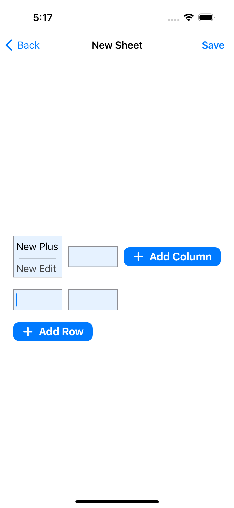

# Sheet SwiftUI App

Screenshot
-------------

<table>
    <tr>
      <td>  </td>
      <td>  </td>
    </tr>
    <tr>
      <td>  </td>
      <td>  </td>
    </tr>
    <tr>
      <td>  </td>
    </tr>
</table>
